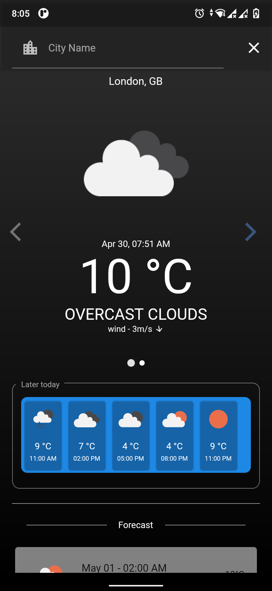
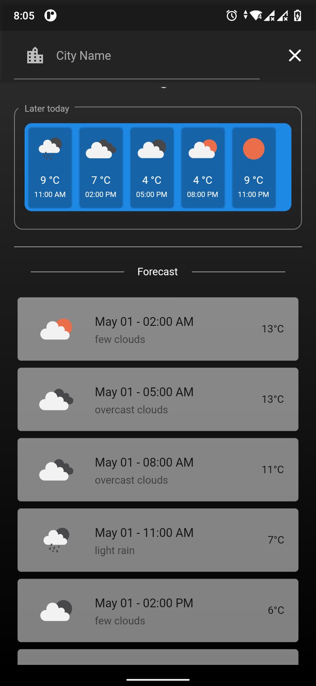
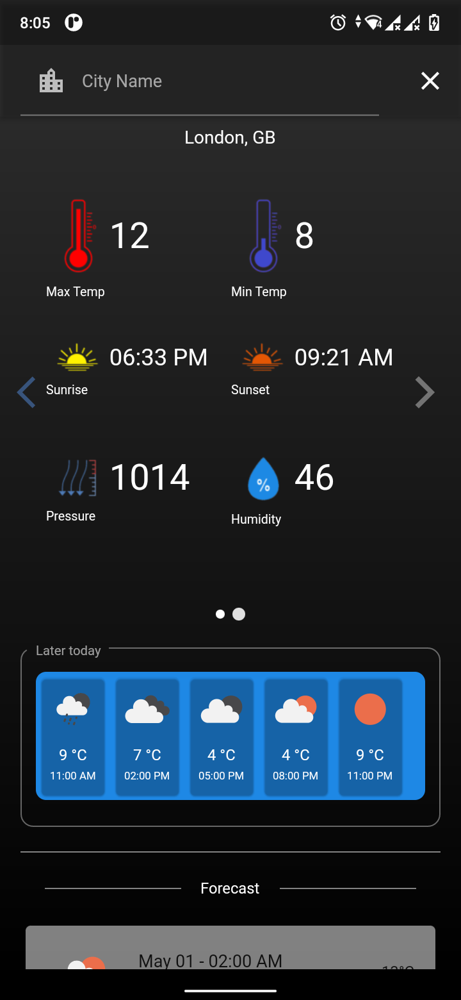

# Degrees
### _Flutter weather app_


## Features

- Shows Current weather status of a city
- Shows Forecast for 5 days
- Simple yet elegant UI
- Use of animations
- State management with Get

## Screenshots





## Installation

Degrees requires [Flutter](https://flutter.dev/) v2.0+ to run.
Clone the repo first
```sh
git clone https://github.com/nikkon404/degrees.git
```

Goto the project directory
```sh
cd degrees
```


Then run the following commands:

```sh
flutter pub get
flutter run
```
